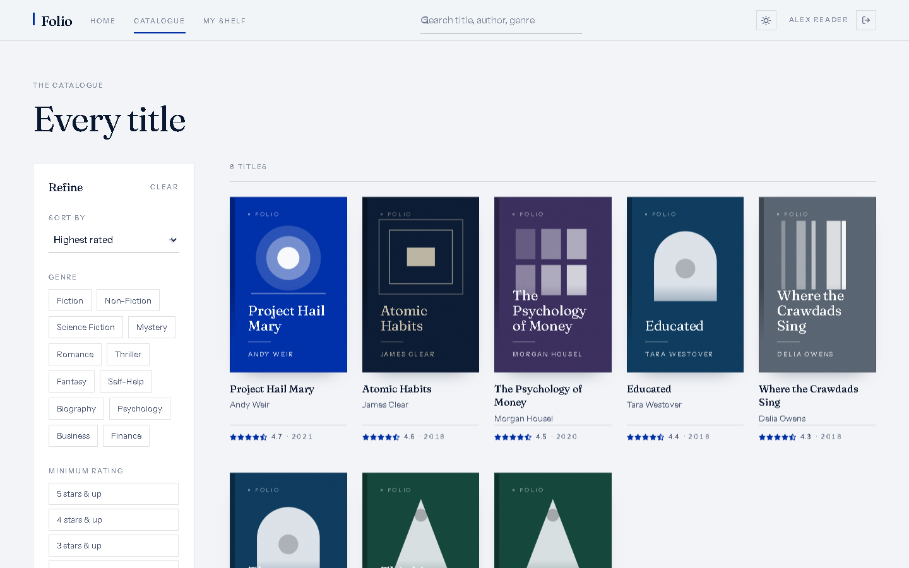
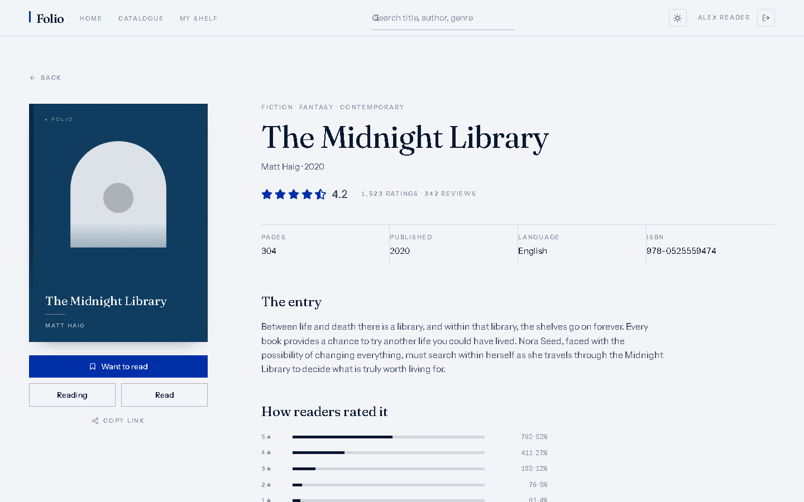
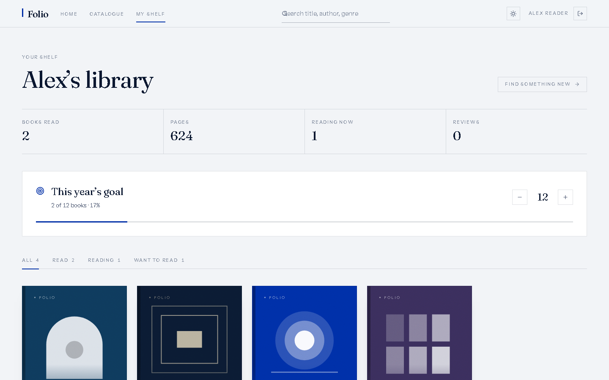
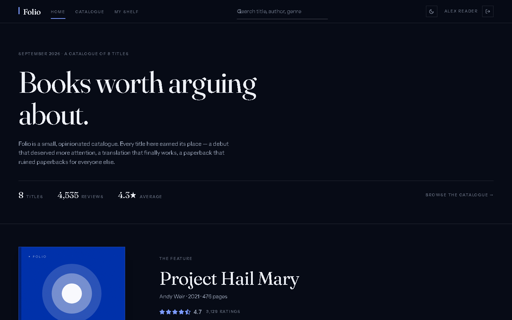
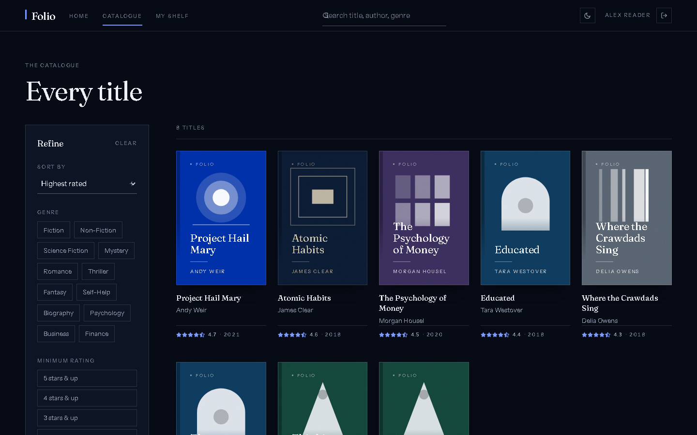

# Folio

[](https://github.com/0x-Shadow/folio/actions/workflows/ci.yml)
[](./LICENSE)
[](https://reactjs.org/)
[](https://vitejs.dev/)

A reading catalogue set in type. Folio is a book-review platform with local accounts, a personal shelf, a yearly reading goal, and recommendations drawn from what you've read — presented like a fine-press catalogue rather than a dashboard. React 19, Vite 7, Tailwind CSS 4.

Live demo: https://0x-shadow.github.io/folio/

## Screenshots

| Front | Catalogue | Entry | Shelf |
|-------|-----------|-------|-------|
|  |  |  |  |
| Home | Explore | Book detail | My shelf |

### Dark

| Front | Catalogue |
|-------|-----------|
|  |  |
| Home | Explore |

## The design

Folio's interface borrows from print catalogues rather than app stores:

- **Designed jackets, not stock photos** — every book gets a cover composed from a colour field, a motif (arch, orbit, horizon, grid, stripes, peak, waves, frame), a spine, an imprint mark, and its own type. Covers are deterministic per book, drawn locally as SVG, so they load instantly, never shuffle, and never break.
- **Paper, ink, one blue** — three inks and a single accent (`#002FA7`) on cool paper, inverted to near-black ink for dark mode. Hairline rules divide space; shadows are reserved for the covers.
- **Type** — [Fraunces](https://fonts.google.com/specimen/Fraunces) for display, [Instrument Sans](https://fonts.google.com/specimen/Instrument+Sans) for text, with letterspaced small-caps labels in the place of badges.
- **Restrained motion** — page rise, a progress rule on navigation, covers lifting on hover, and a timed cross-fade when the appearance switches. Everything respects `prefers-reduced-motion`.

## What's inside

| Path | What it is | Status |
|------|------------|--------|
| `src/pages/` | Front, catalogue, entry, shelf, search, sign-in, onboarding, 404 | ✅ Develop here |
| `src/components/` | Covers, cards, rating, filters, reviews, layout | ✅ Develop here || `src/context/` + `src/hooks/` | Auth and theme providers, `useAuth` / `useTheme` | ✅ Develop here |
| `src/lib/` | Safe storage, shelf store, review store, recommendation engine | ✅ Develop here |
| `src/data/` | Catalogue data (books, reviews, shelves, genres) | ✅ Develop here |
| `src/index.css` | Design tokens (paper / ink / cobalt), type scale, motion | ✅ Develop here |
| `screenshots/` | README screenshots | ✅ Keep updated |

## Quickstart

```bash
npm install
npm run dev
```

Open http://localhost:5173/folio/ (the app is served under the `/folio/` base path).

## Checks (also run in CI)

```bash
npm run lint    # must be clean
npm run build   # must build
```

## Deployment

The site is hosted on GitHub Pages:

```bash
npm run deploy  # build + publish dist/ to gh-pages
```

## Features

- **Accounts** — sign up, sign in, or browse as a guest; everything is stored on the device
- **Taste onboarding** — pick genres and the highest-rated title from each lands on your Want-to-read shelf
- **Your shelf** — reading stats set as a table, plus an adjustable yearly goal with progress
- **Catalogue** — genre and rating filters, four sort orders, and a mobile filter drawer
- **Search** — instant matching across titles, authors, and genres
- **Entry pages** — metadata table, rating distribution, shelf actions, and the review column
- **Reviews** — star rating with validation, saved per account
- **Recommendations** — scored from your shelves, on the front page and every entry
- **Appearance** — light and dark, persisted, following the system by default
- **Resilience** — error boundary, 404, skip link, and labelled controls

## Configuration

No secrets or environment variables. Auth, shelves, goals, and reviews live in `localStorage` (demo-grade by design — swap `src/context/` and `src/lib/` for a real API). Replace the modules in `src/data/` to change the catalogue; they are the only data-access layer.

## Contributing

PRs welcome — small and focused wins. Open an issue first for anything large.

Branch from `master`: `git checkout -b feat/short-description`. Run the checks above; update docs if behavior changes. Open a PR (screenshots where relevant).

Details: [CONTRIBUTING.md](./CONTRIBUTING.md) · [CODE_OF_CONDUCT.md](./CODE_OF_CONDUCT.md) · [SECURITY.md](./SECURITY.md)

## License

MIT © 2026 0x-Shadow — see [LICENSE](./LICENSE).
